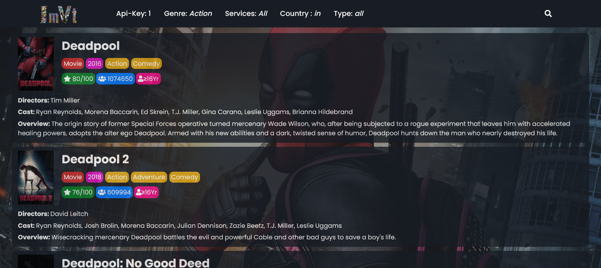

# IMVT Website

Welcome to IMVT (Internet Movie and TV Show Tracker), a website that allows you to search for any movie or series and retrieve detailed information about it. With IMVT, you can find the title, poster, year of release, genres, IMDb rating, number of people who rated it, minimum age to watch, names of directors and cast members, and an overview of the movie or series.

## Live Site

You can access the live site of IMVT by visiting [imvt.live](https://imvt.live).

## Screenshots

Here are some screenshots of the IMVT website:


*Desktop view*


*Mobile view*


*Tablet view*


## Run Locally

1. Clone the project

```bash
  git clone https://github.com/VISHWAJ33T/imvt
```

2. Go to the project directory

```bash
  cd imvt
```

3. Install dependencies

```bash
  npm install
```

4. Create a `.env.local` file in the root directory of the project.

5. Open the `.env.local` file and add the following lines, replacing `"apikey1"`, `"apikey2"`, and `"apikey3"` with your actual API keys obtained from the Streaming Availability API:
```plaintext
REACT_APP_IMVT_API_KEY_1="apikey1"
REACT_APP_IMVT_API_KEY_2="apikey2"
REACT_APP_IMVT_API_KEY_3="apikey3"
```

6. Start the server

```bash
  npm start
```

7. Open your browser and visit http://localhost:3000 to access the IMVT website.

Please note that you can only search for up to 100 movies/series per day with one API key due to the limitations of the Streaming Availability API.

## Technologies Used

This project was developed using the following technologies:

    HTML
    CSS
    JavaScript
    React.js
    Visual Studio Code


## Watching Movies

IMVT provides the convenience of watching movies directly on our website. By clicking on the poster of a movie or series, you will be able to stream it within our website using the 2embed iframe integration. Please note that the availability of movies for streaming may vary.

## IMDb Integration

For those interested in exploring more about a particular movie or series, IMVT provides a direct link to the IMDb page. By clicking on the title of a movie or series, you will be redirected to the respective IMDb page, where you can find additional information, reviews, and ratings.


## Important Note
Please keep in mind that the information provided by IMVT is based on the data obtained from the "Streaming Availability" API by Movie of the Night. While we strive to provide accurate and up-to-date information, there may be occasional discrepancies or changes in the availability of content. We apologize for any inconvenience caused.